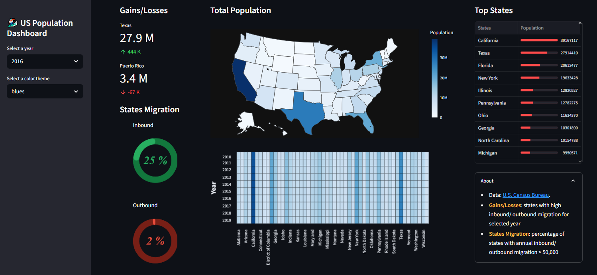

# 🏂 US Population Dashboard

An interactive web dashboard built with **Streamlit** to visualize U.S. population data from **2010 to 2019**.  
It allows users to explore trends, migration patterns, and population differences by state — using beautiful charts from **Altair** and **Plotly**.

---

## 📊 Features

- 📅 Year selector to filter population data
- 🗺️ Choropleth map of U.S. states by population
- 🔥 Heatmap showing year-on-year change
- 🍩 Donut charts to visualize inbound/outbound migration
- 📋 Table of top states with population bar indicators
- 🧠 Insights into states with largest gains and losses

---

## 🗃️ Dataset Info

- **Source**: [U.S. Census Bureau](https://www.census.gov/data/datasets/time-series/demo/popest/2010s-state-total.html)
- **Years covered**: 2010 to 2019
- **Columns used**: `states`, `states_code`, `year`, `population`, `id`

---

## 📁 Folder Structure
**us-population-dashboard/**
- │
- ├── main.py # Main Streamlit app
- ├── data/
- │      └── us-population-2010-2019-reshaped.csv
- ├── requirements.txt # Python dependencies
- └── README.md # Project documentation

---

## ▶️ How to Run the Dashboard

### 🧰 1. Clone the repository

```bash
git clone https://github.com/supunwickramarachchi/us-population-dashboard.git
cd us-population-dashboard
```
## 🐍 2. Create a virtual environment
```bash
python -m venv venv
# On Windows:
venv\Scripts\activate
# On Linux/macOS:
source venv/bin/activate
```
## 📦 3. Install dependencies
```bash
pip install -r requirements.txt
```
## 🚀 4. Launch the dashboard
```bash
streamlit run app.py
```
_Then open the link that appears in your terminal (usually http://localhost:8501)._

---

## 💻 Tech Stack
| Tool  | Description |
| ------------- | ------------- |
| Streamlit  | Frontend web framework  |
| Pandas  | Data manipulation and filtering |
| Altair | Declarative statistical visualization |
| Plotly | Interactive choropleth maps |

---
## 📸 Screenshots


## 🙏 Credits
Original idea by Chanin Nantasenamat (Data Professor)

Dataset from the U.S. Census Bureau

---

## 🚀 Live Demo

👉 [Click here to view the live dashboard](https://us-population-dashboard-bvgoomdjz42pt6zhbuynf7.streamlit.app)


---

## 📬 Contact
Supun Wickramarachchi

📧 [Email Address: SupunWickramarachchi](supun9718wic@gmail.com)

🌐 [Github: Supun Wickramarachchi](https://github.com/supunwickramarachchi)

📍 Sri Lanka

---

## 📄 License
This project is open-source and available under the MIT License.

[View LICENSE](LICENSE)